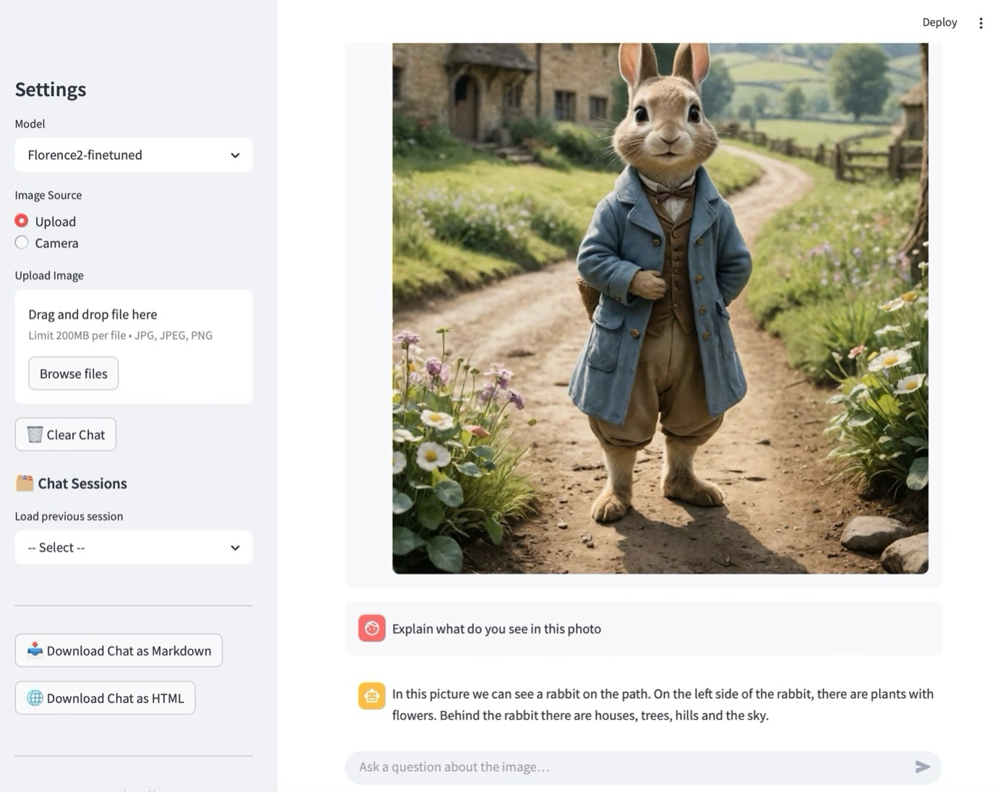

# VisionAid-VQA: Inclusive Visual Question Answering Using Deep Learning and Multimodal Attention Mechanisms

This Streamlit web application allows users to upload or capture an image, ask a question about it, and receive **text and audio responses** using advanced **Visual Question Answering (VQA)** models. The system is designed for accessibility, especially supporting visually impaired users.



---

## 🧠 Features

- 🔍 Supports VQA models:
  - `vilt_finetuned_vizwiz` (Transformer-based vision language model finetuned with VizWiz)
  - `florence2-finetuned` (Unified vision language model finetuned with VizWiz)
- 📷 Accepts image input from upload or camera
- ❓ Accepts natural language questions 
- 🔊 Converts text answers to speech using `gTTS`
- 🎧 Auto-plays audio response in the app

---

## 📁 Project Structure

```graphql
project_root/
├── data # Dataset directory 
├── modules/
│   ├── robust_vilt.py # ViLT inference module
│   ├── florence2.py # Florence-2 inference module
├── models
│   ├── vilt_finetuned_vizwiz # ViLT model weight
│   ├── florence2-finetuned # Florence-2 model weight
├── scripts # Fine-tuning and evaluation scripts
├── app.py # Streamlit app
```

## Setup
---
1. Clone the repository:
```bash
git clone https://github.com/zagarsuren/visionaid-vqa
cd visionaid-vqa
```

2. Create a Virtual Environment
Upgrade pip:
```bash
pip install --upgrade pip
```

Create and activate Virtual Environment (Windows):
```bash
python -m venv vqa
vqa\Scripts\activate
```

Create and activate Virtual Environment (Linux):
```bash
python3 -m venv vqa
source vqa/bin/activate
```

3. Install the dependencies:
```bash
pip install -r requirements.txt
```

## 🧠 Model Weights

- `ViLT` → `/models/vilt_finetuned_vizwiz`. ViLT model weight can be found at: [https://huggingface.co/Zagarsuren/vilt-finetuned-vizwiz](https://huggingface.co/Zagarsuren/vilt-finetuned-vizwiz)
- `Florence2Model` → `/models/florence2-finetuned` Florence-2 model weight can be found at: [https://huggingface.co/Zagarsuren/florence2-finetuned-vizwiz](https://huggingface.co/Zagarsuren/florence2-finetuned-vizwiz)

## To run the Web App
```bash
streamlit run app.py
```

## License
This project is licensed under the MIT License.